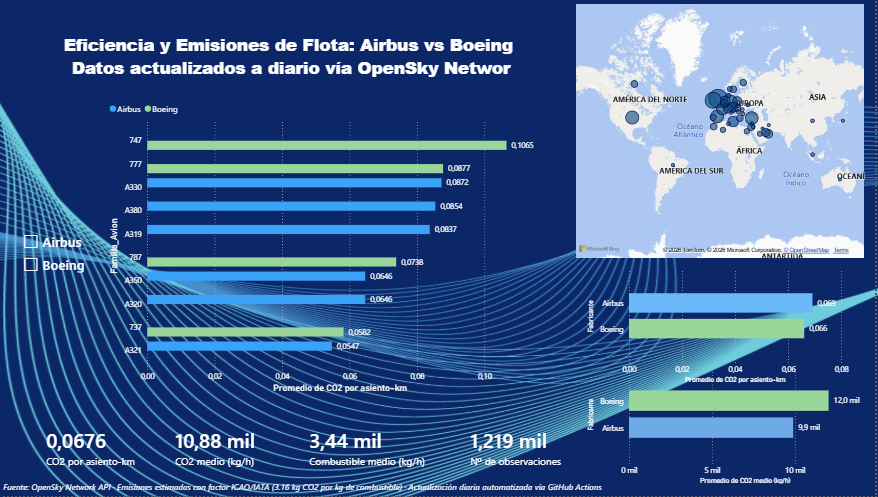
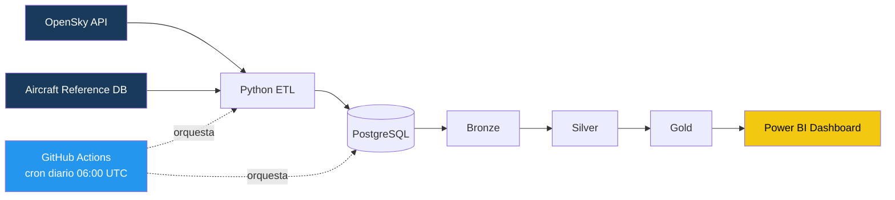
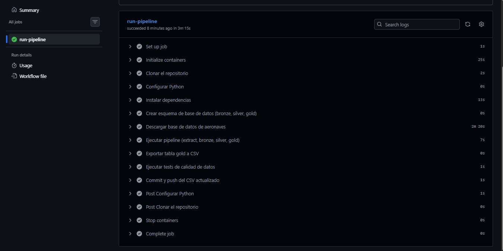
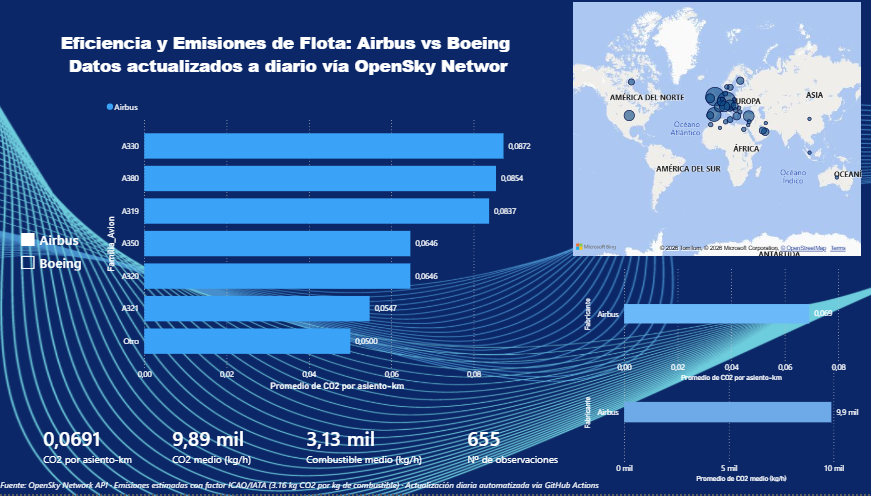
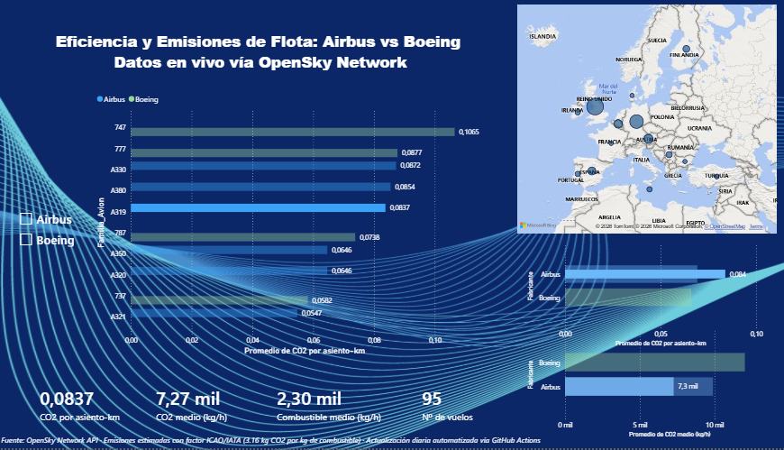

<div align="center">

# ✈️ Airbus vs Boeing — Fleet Efficiency & CO₂ Analytics

**Pipeline de datos y dashboard de eficiencia real de flota Airbus vs Boeing, con datos reales de vuelos en vivo (OpenSky Network)**

[](https://github.com/Dguillenc/airbus-fleet-efficiency/actions/workflows/pipeline.yml)


</div>

---

## 💡 Por qué este proyecto

¿Qué avión contamina más, un A380 o un A320? La respuesta intuitiva ("el más grande") es incorrecta si lo que importa es **cuánto CO₂ emite por pasajero transportado**, no en total. Este proyecto nace de cuestionar esa métrica ingenua y construir la correcta: **CO₂ por asiento y kilómetro**, el mismo tipo de indicador que usa la industria aeroespacial para medir eficiencia real — no solo "cuánto consume", sino "cuánto consume por lo que transporta".

Todo el pipeline corre sobre **datos reales en vivo** (no simulados) de tráfico aéreo europeo, se actualiza solo cada día, y el resultado se visualiza en un dashboard de Power BI diseñado para responder, de un vistazo, la pregunta que da título al proyecto.

---

## 📊 Vista previa del dashboard



---

## 🧭 Resumen del proyecto

Este proyecto implementa un **pipeline de datos end-to-end (ELT)** que captura posiciones de vuelo en tiempo real desde la **API de OpenSky Network**, las cruza con una base de referencia de aeronaves y calcula dos tipos de métricas por hora de vuelo, siguiendo una arquitectura de datos por capas (**Medallion: Bronze → Silver → Gold**):

- **Consumo y emisiones totales** (kg de combustible/CO₂ por hora) — mide impacto absoluto.
- **Eficiencia real** (kg de CO₂ por asiento y kilómetro) — mide impacto por unidad de transporte, la métrica que de verdad permite comparar de forma justa un A320 con un A380.

El resultado se consume en un **dashboard de Power BI** que compara Airbus vs Boeing tanto en consumo total como en eficiencia real, desglosado por familia de avión (A320, A321, A330, A350, A380, 737, 747, 777, 787...) y con mapa geográfico del tráfico capturado.

El pipeline se ejecuta de forma **automática y diaria** mediante GitHub Actions, sin intervención manual.
---
## 🔍 Insights clave

**¿Qué fabricante es más eficiente por pasajero?** Prácticamente empatados — Boeing (0,064 kg CO₂/asiento-km) es marginalmente más eficiente que Airbus (0,066), una diferencia de apenas un 3% en la muestra analizada. La narrativa de "un fabricante es claramente más limpio" no se sostiene con estos datos.

**¿El avión más grande es el que más contamina por pasajero?** No necesariamente. El A380 y el 747 no encabezan el ranking de peor eficiencia pese a ser los aviones de mayor consumo total — al llevar muchos más asientos, reparten sus emisiones entre más gente. El A319, un avión mucho más pequeño, resultó menos eficiente por asiento-km en esta muestra.

**¿Cuánto CO₂ emite un vuelo medio por pasajero?** En torno a 0,065 kg de CO₂ por asiento y kilómetro en fase de crucero — cifra que representa un escenario optimista (capacidad teórica, no ocupación real) frente a las cifras de la industria basadas en factor de ocupación y vuelo completo.

> Estos insights se basan en 500-700 vuelos capturados en una única ejecución del pipeline. Al actualizarse a diario, la muestra crece con el tiempo, permitiendo un análisis cada vez más robusto.
---
## 🏗️ Arquitectura



**Orquestación:** GitHub Actions ejecuta el pipeline completo cada día, levantando un contenedor efímero de PostgreSQL, aplicando el esquema SQL, corriendo el ETL en Python y publicando el CSV final de vuelta al repositorio — sin depender de ningún servicio de pago.

---

## 🛠️ Stack tecnológico

| Capa | Tecnología |
|---|---|
| **Ingesta** | Python (`requests`), API REST de OpenSky Network |
| **Almacenamiento** | PostgreSQL 16 (esquemas `bronze` / `silver` / `gold`) |
| **Transformación** | Python (`pandas`, `psycopg2`) |
| **Orquestación** | GitHub Actions (cron diario + ejecución manual) |
| **Infraestructura local** | Docker / Docker Compose |
| **Visualización** | Power BI (medidas DAX, conexión en vivo vía URL) |
| **Gestión de secretos** | `python-dotenv` + GitHub Secrets |

---

## 📂 Estructura del repositorio

| Ruta | Descripción |
|---|---|
| `.github/workflows/pipeline.yml` | Orquestación diaria (GitHub Actions) |
| `data/reference/` | `aircraftDatabase.csv`, descargado en cada ejecución |
| `data/gold/` | `flight_efficiency.csv`, salida publicada del pipeline |
| `sql/01_bronze.sql` | Esquema de la capa Bronze |
| `sql/02_silver.sql` | Esquema de la capa Silver |
| `sql/03_gold.sql` | Esquema de la capa Gold |
| `src/extract.py` | Llamada a la API de OpenSky |
| `src/load_bronze.py` | Ingesta cruda → Bronze |
| `src/transform_silver.py` | Limpieza + cruce con referencia → Silver |
| `src/transform_gold.py` | Cálculo de consumo/CO₂/eficiencia → Gold |
| `powerbi/dashboard.pbix` | Dashboard de Power BI |
| `docs/images/` | Capturas y diagrama de arquitectura |
| `docker-compose.yml` | PostgreSQL local para desarrollo |
| `requirements.txt` | Dependencias de Python |
| `.env` | Credenciales (no versionado) |

---

## ⚙️ Cómo funciona el pipeline

### 1️⃣ Extracción (`extract.py`)
Consulta el endpoint `/api/states/all` de OpenSky Network acotado a un **bounding box de Europa** (lat 35–60, lon -10–30), obteniendo posición, velocidad, altitud y callsign de todos los vuelos activos en ese momento.

### 2️⃣ Bronze (`load_bronze.py`)
Inserta el payload crudo de cada vuelo en `bronze.raw_flights`, conservando el JSON original (`raw_payload`) para trazabilidad completa además de las columnas ya tipadas.

### 3️⃣ Silver (`transform_silver.py`)
- Descarta registros sin coordenadas válidas.
- Cruza cada vuelo (`icao24`) con el **aircraft reference dataset oficial de OpenSky** para obtener fabricante y modelo.
- Clasifica cada aeronave como `Airbus`, `Boeing` u `Other`.
- Normaliza timestamps a `captured_at`.

### 4️⃣ Gold (`transform_gold.py`)
- Filtra solo aeronaves Airbus/Boeing y descarta inconsistencias conocidas de la fuente (p. ej. registros donde el fabricante y el modelo declarados no coinciden, ~0,3% de los casos).
- Aplica tablas de referencia de **consumo de combustible (kg/h)** y **capacidad de asientos** por familia de modelo, basadas en documentación pública de fabricantes.
- Calcula `estimated_co2_kg_h = fuel_burn_kg_h × 3.16` (factor de conversión ICAO/IATA de kg CO₂ por kg de combustible quemado).
- Calcula la **métrica de eficiencia real**: `co2_per_seat_km = (estimated_co2_kg_h / velocidad_km_h) / capacidad_asientos`, excluyendo vuelos por debajo de 200 km/h (fases de despegue/aterrizaje/rodaje, donde el ratio pierde sentido físico).
- Publica el resultado final en `gold.flight_efficiency`.

### 5️⃣ Publicación
El job de GitHub Actions exporta `gold.flight_efficiency` a CSV (`data/gold/flight_efficiency.csv`) y lo commitea automáticamente al repositorio, dejándolo listo para ser consumido por Power BI vía conexión en vivo a la URL raw de GitHub.

---

## 🚀 Puesta en marcha local

### Requisitos previos
- Python 3.12+
- Docker y Docker Compose
- Cuenta gratuita en [OpenSky Network](https://opensky-network.org/) (usuario/contraseña de la API)

### Pasos

```bash
# 1. Clonar el repositorio
git clone https://github.com/Dguillenc/airbus-fleet-efficiency.git
cd airbus-fleet-efficiency

# 2. Crear entorno virtual e instalar dependencias
python -m venv venv
venv\Scripts\activate        # Windows
source venv/bin/activate     # Linux/Mac
pip install -r requirements.txt

# 3. Configurar variables de entorno
# Crear un archivo .env en la raíz con:
#   DB_PASSWORD=tu_password
#   OPENSKY_USER=tu_usuario
#   OPENSKY_PASS=tu_password_opensky

# 4. Levantar PostgreSQL con el esquema Bronze/Silver/Gold ya inicializado
docker compose up -d

# 5. Descargar la base de referencia de aeronaves de OpenSky
curl -L -o data/reference/aircraftDatabase.csv https://opensky-network.org/datasets/metadata/aircraftDatabase.csv

# 6. Ejecutar el pipeline completo
python src/load_bronze.py
python src/transform_silver.py
python src/transform_gold.py
```

---

## 🔄 Automatización (GitHub Actions)



El workflow [`pipeline.yml`](.github/workflows/pipeline.yml):

- Se ejecuta **automáticamente cada día a las 06:00 UTC** y también de forma manual (`workflow_dispatch`).
- Levanta un servicio de PostgreSQL efímero como parte del job (sin necesidad de una base de datos en la nube de pago).
- Aplica el esquema SQL (`bronze` → `silver` → `gold`).
- Descarga la última versión del `aircraftDatabase.csv` de OpenSky.
- Ejecuta el ETL completo (`extract → bronze → silver → gold`).
- Exporta la tabla Gold a CSV y hace commit/push automático del resultado, con reintentos ante condiciones de carrera si dos ejecuciones coinciden.

**Secrets requeridos en el repositorio de GitHub:**

| Secret | Descripción |
|---|---|
| `DB_PASSWORD` | Contraseña de PostgreSQL |
| `OPENSKY_USER` | Usuario de la API de OpenSky |
| `OPENSKY_PASS` | Contraseña de la API de OpenSky |

---

## 📈 Dashboard (Power BI)

El dashboard conecta **en vivo** a la URL raw de `data/gold/flight_efficiency.csv` en GitHub, por lo que cada "Actualizar" trae los datos más recientes generados por el pipeline automático. Incluye:

- **CO₂ por asiento-kilómetro** por familia de avión y por fabricante — la métrica de eficiencia real, el corazón analítico del proyecto.
- **Consumo y emisiones totales (kg/h)** por fabricante y familia — para contraste con la eficiencia.
- **KPIs agregados**: CO₂ por asiento-km medio, CO₂ medio, combustible medio y número de vuelos analizados.
- **Mapa geográfico** con la densidad de tráfico aéreo detectado en el bounding box europeo.
- **Filtro interactivo por fabricante** para aislar la flota Airbus o Boeing en todos los visuales a la vez.



---

## ⚠️ Metodología y limitaciones

- Los datos de posición provienen de **ADS-B en tiempo real** vía OpenSky Network, por lo que la cobertura depende de la densidad de receptores terrestres (mayor en Europa y Norteamérica).
- El **consumo de combustible y capacidad de asientos por modelo** se basan en cifras públicas de fabricantes y reportes operativos de referencia; los valores estimados por interpolación entre modelos similares se documentan explícitamente en el propio código (`src/transform_gold.py`).
- La métrica `co2_per_seat_km` se calcula sobre **capacidad de asientos** (configuración típica), no sobre **ocupación real** de cada vuelo, y solo considera **fase de crucero** (velocidad ≥ 200 km/h). Por tanto, representa un escenario optimista frente a cifras de la industria basadas en factor de ocupación real y vuelo puerta a puerta completo (incluyendo despegue y aterrizaje).
- El factor de **3,16 kg CO₂ por kg de combustible** corresponde al estándar de conversión utilizado por ICAO/IATA para combustible de aviación (Jet A-1).
- Se detectaron y excluyeron inconsistencias puntuales en la base de datos comunitaria de OpenSky (fabricante y modelo declarados no coincidentes en ~0,3% de los registros).
- Este proyecto tiene fines **analíticos y de portfolio**; no sustituye cálculos oficiales de emisiones certificadas (p. ej. metodología ICAO CO₂ Certification).

---

## 👤 Autor

**Daniel Guillén**
Técnico de mantenimiento electrónico/eléctrico (sistemas de defensa) en transición hacia Data Engineering & Analytics Engineering.

[GitHub](https://github.com/Dguillenc) · [LinkedIn](https://linkedin.com/in/danielgc97)

---

<div align="center">
<sub>Fuente de datos: OpenSky Network API · Factor de emisiones ICAO/IATA (3,16 kg CO₂ por kg de combustible) · Actualización diaria automatizada vía GitHub Actions</sub>
</div>
